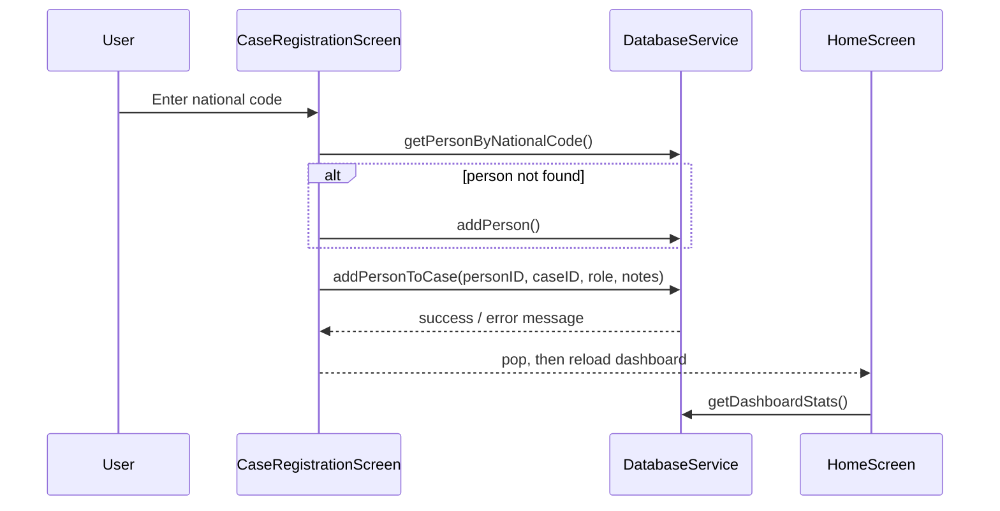

<div align="center">


### *Register a Case. Attach the People. See the Whole Picture.*

[](https://flutter.dev)
[](https://dart.dev)
[](#-design-system)
[](#-design-system)
[](LICENSE)
[](http://makeapullrequest.com)

**Register • Attach • Track • Report**

[Features](#-features) • [Design System](#-design-system) • [Architecture](#-architecture) • [Setup](#-setup) • [How Registration Works](#-how-case-registration-works) • [Contributing](#-contributing)

</div>

---

## 📖 Overview

**سیستم مدیریت دادگستری** gives court staff a single place to register cases, attach people to those cases with a role, track prosecutors and courts, and see live dashboard stats — all in a fully right-to-left, **Persian-language** interface built on Flutter and Material 3.

No case-management suite bloat: a `StatefulWidget` + `setState` UI talking to a plain REST backend through one service class, wrapped in a premium, gradient-driven, animated shell.

<div align="center">

### 🎯 **Why This App?**

| **Fully RTL & Persian** | **One Service, One Contract** | **Fails Soft, Never Crashes** | **Reusable UI Kit** |
|:---:|:---:|:---:|:---:|
| `Directionality.rtl` + `fa_IR` locale + Cairo font app-wide | Every model has dual-cased `fromMap`/`toMap` for a flexible API | Every `DatabaseService` call catches its own errors | Shared `CaseCard` / `CustomButton` keep styling consistent |

</div>

---

## ✨ Features

### 🏠 Dashboard & Navigation

```mermaid
graph LR
    A[MainScreen] --> B[HomeScreen]
    A --> C[CaseListScreen]
    A --> D[PersonListScreen]
    A --> E[ReportsScreen]
    B --> F[/dashboard-stats/]
    B --> G[CaseRegistrationScreen]

    style A fill:#1a2340
    style F fill:#241a40
```



- **Live dashboard** — total/active/closed case counts and registered-person count, pulled from a single stats endpoint
- **Bottom-tab navigation** — Home, Cases, Persons, Reports, with an `AnimatedSwitcher` transition between tabs
- **Pull-to-refresh** — dashboard and list screens refresh live data on demand

### 📋 Case & Person Management

| Capability | Detail |
|---|---|
| **Case registration flow** | Look up a person by national code (or register a new one), then attach them to a case with a role, join date, and notes |
| **Case list** | Animated, staggered rendering of all cases via `flutter_staggered_animations` |
| **Person list** | Every case-person link shown with role and linked case, color-cycled for quick scanning |
| **Status color-coding** | Case cards color status directly: green = در جریان, red = بسته شده, orange = anything else |
| **Reports screen** | Dedicated tab for case/person reporting |

### 🧩 Typed Data Layer

- **Five typed models** — `Case`, `Person`, `CasePerson`, `Court`, `Prosecutor`, each with dual-cased (`camelCase` / `PascalCase`) `fromMap`/`toMap` for a permissive REST contract
- **Graceful network failures** — every `DatabaseService` call is independently wrapped so a failed request returns an empty result instead of crashing the UI

### 🎨 Animated, Gradient-Driven UI

- **Per-screen gradient identity** — Home, navigation bar, and Person list each carry their own signature gradient, layered over a shared Material 3 base
- **Motion throughout** — `animate_do` fade/slide-in entrances and `flutter_staggered_animations` staggered reveals replace static screen loads

---

## 🎨 Design System

Rather than one fixed brand gradient, each screen carries its own gradient identity over a shared Material 3 base:

```
Home                 #1e3c72 → #2a5298   (deep navy sweep)
Bottom nav bar        #667eea → #764ba2   (violet-purple, app anchor)
Person list            #6a11cb → #2575fc   (indigo-to-blue)
Stat tiles (Home)       4 accent gradients: orange-red · cyan-blue · green-teal · pink-yellow
Person cards             cycle through 4 complementary gradient pairs
Status colors             green = در جریان · red = بسته شده · orange = other
```

All base typography and Material theming live in `MaterialApp.theme` in `main.dart` — swapping the base font or seed color is a one-file edit. Per-screen gradients live locally in each screen file.

---

## 🏗️ Architecture

A simple, pragmatic split between UI, models, and a service layer — no state-management package, just `StatefulWidget` + `setState`.

```mermaid
graph TD
    Screens[screens/] --> Widgets[widgets/]
    Screens --> Service[services/database_service.dart]
    Service --> Models[models/]
    Models -->|fromMap/toMap only, zero UI| Pure[Pure Dart · Screens Never Touch Raw JSON]

    style Service fill:#1a2340
    style Pure fill:#241a40
```



```
lib/
├── main.dart                          # app entry, MaterialApp, locale/RTL/theme setup
├── models/
│   ├── case.dart
│   ├── case_person.dart
│   ├── court.dart
│   ├── person.dart
│   └── prosecutor.dart
├── services/
│   └── database_service.dart          # all HTTP calls to the backend REST API
├── screens/
│   ├── main_screen.dart                # bottom-nav shell + AnimatedSwitcher
│   ├── home_screen.dart                 # dashboard stats + quick actions
│   ├── case_list_screen.dart
│   ├── case_registration_screen.dart
│   ├── person_list_screen.dart
│   └── reports_screen.dart
└── widgets/
    ├── case_card.dart
    └── custom_button.dart
```

**Why this split:** every model carries its own `fromMap`/`toMap`, so screens never touch raw JSON. `DatabaseService` is the single choke point for all network I/O — every method independently catches its own errors and falls back to an empty/zeroed result, so one flaky endpoint never crashes a screen. Shared visual pieces (`CaseCard`, `CustomButton`) are pulled out of `widgets/` specifically so status-color logic and button styling don't drift between screens.

---

## 🛠️ Requirements

| Tool | Version |
|---|---|
| Flutter | 3.x (Dart ≥3.0.0 <4.0.0) |
| Backend | A REST API matching the endpoints in `database_service.dart` (`/courts`, `/cases`, `/persons`, `/casepersons`, `/prosecutors`, `/dashboard-stats`) |

---

## 🚀 Setup

```bash
git clone <this-repo>
cd judiciary_app
flutter pub get
```

Before running, point `DatabaseService._baseUrl` in `lib/services/database_service.dart` at your actual backend host — it currently returns a bare `"http:"` placeholder for both web and Android and needs a real host/port filled in (e.g. `http://10.0.2.2:5000` for an Android emulator talking to a local server, or your LAN IP for a physical device).

### Run

```bash
flutter run
```

### Test

```bash
flutter test
```

### Build

```bash
# Debug APK
flutter build apk --debug

# Release APK
flutter build apk --release
```

---

## 🔄 How Case Registration Works



1. `CaseRegistrationScreen` looks up an existing person by national code via `DatabaseService.getPersonByNationalCode`.
2. If no match is found, a new `Person` is created through `DatabaseService.addPerson`.
3. The resolved person is then linked to a case with `DatabaseService.addPersonToCase(personID, caseID, role, notes)`, which stamps a `JoinDate` of `DateTime.now()` and posts to `/casepersons`.
4. `HomeScreen.loadDashboardData` is re-run after registration (via `.then()` on the navigation `Future`) so dashboard counters reflect the new record immediately.

---

## 🐛 Troubleshooting

<details>
<summary><b>All lists come back empty</b></summary>

Check `DatabaseService._baseUrl` — every service method silently swallows errors and returns `[]`/zeroed stats, so a bad URL looks like "no data" rather than a crash.

</details>

<details>
<summary><b>Fonts look wrong / fallback system font shows</b></summary>

`google_fonts` downloads Cairo at runtime; make sure the device has network access on first launch, or bundle the font locally for offline builds.

</details>

<details>
<summary><b>App doesn't render RTL correctly on a specific widget</b></summary>

Confirm the widget isn't wrapped in its own `Directionality.ltr` override — the app-wide RTL is set once in `main.dart`'s `builder`.

</details>

<details>
<summary><b>MissingPluginException on first run</b></summary>

```bash
flutter clean && flutter pub get
```
Then rebuild.

</details>

<details>
<summary><b>Person lookup by national code always fails</b></summary>

Confirm the backend route `/persons/by-nationalcode/:code` exists and returns `200` with a JSON body matching `Person.fromMap`'s expected keys.

</details>

For anything else, run `flutter run` (not a release build) and read the actual Dart stack trace in the terminal.

---

## 🤝 Contributing

Contributions are welcome! Here's how to get started:

```bash
# 1. Fork the repository on GitHub

# 2. Clone your fork
git clone https://github.com/YOUR_USERNAME/judiciary_app.git

# 3. Create a feature branch
git checkout -b feature/your-feature-name

# 4. Make your changes and commit
git commit -m "Add: description of your change"

# 5. Push and open a Pull Request
git push origin feature/your-feature-name
```

### Areas to Contribute

| Area | Ideas |
|---|---|
| ⚖️ **Cases** | Case timeline / hearing history view, document attachments |
| 👥 **Persons** | Duplicate national-code detection, person profile screen |
| 🔐 **Auth** | Role-based login for staff vs. read-only viewers |
| 📊 **Reports** | Exportable PDF/Excel reports, filterable date ranges |
| 🌐 **i18n** | English fallback locale alongside Persian |
| 🧪 **Tests** | Widget tests for `HomeScreen` stat loading, service-layer mocks |

---

## 📄 License

MIT — do whatever you'd like, just keep the license notice.

---

## 🙏 Acknowledgments

<div align="center">

### Built With Na7iD

[](https://flutter.dev)
[](https://dart.dev)
[](https://m3.material.io)

### Special Thanks To

**Flutter Team** | **google_fonts Maintainers** | **Open Source Contributors**
:---: | :---: | :---:
For a toolkit that makes RTL, theming, and animation painless | For effortless custom typography | animate_do, flutter_staggered_animations, shimmer and more

</div>

---

<div align="center">


### ✨ **Built with ❤️ for staff who deserve software that speaks their language** ✨

[](https://github.com/7Na7iD7)

</div>
